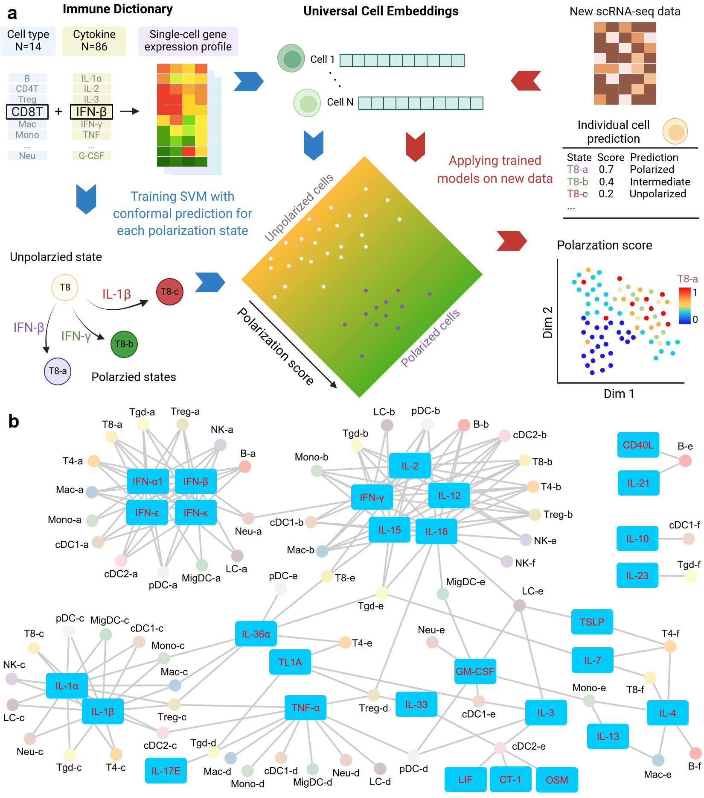

# Scupa

Scupa is an R package for immune cell polarization assessment of scRNA-seq data.

Scupa relies on the Universial Cell Embedding (UCE) to assess the polarization of 14 immune cell types from the Immune Dictionary:

B, NK, CD8T, CD4T, Treg, Tgd, pDC, cDC1, cDC2, MigDC, LC (Langerhans cell), Macrophage, Monocyte, Neutrophil.

With UCE's property, Scupa can be applied to various animals for unified polarization analysis.



The framework of Scupa and immune cell polarization states with driving cytokines

## Installation

```r
if (!require("remotes", quietly = TRUE))
    install.packages("remotes")
remotes::install_github("bsml320/scupa")
```

## Usage and vignettes

### Step 1. Prepare UCEs (using python)

See the vignette [vignette_run_UCE_ifnb.ipynb](inst/notebook/vignette_run_UCE_ifnb.ipynb) for a quick tutorial.

Before running Scupa, it is necessary to generate the UCE embeddings for the input scRNA-seq dataset. Please install UCE (https://github.com/snap-stanford/UCE) and run it on the input dataset.

This step is **required**! Scupa cannot run on a dataset without UCE embeddings. 

### Step 2. Run Scupa (using R)

See the vignette [vignette_scupa_ifnb.ipynb](inst/notebook/vignette_scupa_ifnb.ipynb) for a quick tutorial.

The R package schard (https://github.com/cellgeni/schard/) helps convert the UCE output h5ad data to a Seurat object. Otherwise, the users could create a Seurat object with UCE embeddings saved in an assay or dimensional reduction structure on their own.

```r
seuobj <- schard::h5ad2seurat('output_uce_adata.h5ad')
```

After conversion, run *MeasurePolar* function to analyze the polarization of input cells to different polarization states.

```r
library(scupa)
# Replace input_type with one of: 
#   B, NK, CD8T, CD4T, Treg, Tgd, pDC, cDC1, cDC2, MigDC, LC, Macro, Mono, Neu.
# Replace cell_names with the names of unpolarized cells, or NA if uncertain.
#   See ?MeasurePolar for details
seuobj <- MeasurePolar(seuobj, celltype=input_type, embedding='uce', unpolarized_cell=cell_names)
```

## Output

By default, Scupa outputs a Seurat object with the updated metadata. Each cell type has 4-6 polarization states. For each polarization state, Scupa outputs the following variables for all cells:

1. polarization scores (range 0-1). Larger scores indicate stronger polarization. 
2. conformal predictions. A cell will be predicted as one of [Polarized, Unpolarized, Intermdiate (similar to both Polarized and Unpolarized), Uncertain (dissimilar to both Polarized and Unpolarized)]. The conformal predictions are controlled by the parameter error_level. 

The scores and conformal predictions can be visualized by Seurat functions FeaturePlot, DimPlot, etc.

See the vignette [vignette_scupa_ifnb.ipynb](inst/notebook/vignette_scupa_ifnb.ipynb) for an example.

## Test datasets

The datasets with UCE embeddings, along with the code to generate results in our manuscript, are available at:

https://doi.org/10.5281/zenodo.13312247

## Support for other single-cell foundation models

Scupa now supports other two single-cell foundation models, scGPT and scFoundation, instead of UCE. However, UCE has advantages over the other two models and we recommend using Scupa with UCE if possible.

If you would like to use other single-cell foundation models, run the following code before running *MeasurePolar*. Scupa will use the loaded variable *polar_params* for polarization assessment.

```r
# If you use cell embeddings from scGPT (generated using continual pretrained model)
polar_params <- readRDS(url('https://github.com/bsml320/Scupa/raw/refs/heads/master/inst/extdata/polar_params_scgpt.rds'))

# If you use cell embeddings from scFoundation
polar_params <- readRDS(url('https://github.com/bsml320/Scupa/raw/refs/heads/master/inst/extdata/polar_params_scfoundation.rds'))
```

## Citations

If you use Scupa, please consider citing following papers:

* Liu W, Zhao Z. Scupa: Single-cell unified polarization assessment of immune cells using the single-cell foundation model. bioRxiv. 2024. doi: [10.1101/2024.08.15.608093](https://doi.org/10.1101/2024.08.15.608093)
* Cui A, Huang T, Li S, et al. Dictionary of immune responses to cytokines at single-cell resolution. Nature. 2024;625(7994):377-384. doi: [10.1038/s41586-023-06816-9](https://doi.org/10.1038/s41586-023-06816-9)
* Rosen Y, Roohani Y, et al. Universal Cell Embeddings: A Foundation Model for Cell Biology. bioRxiv. 2023. doi: [10.1101/2023.11.28.568918](https://doi.org/10.1101/2023.11.28.568918)

